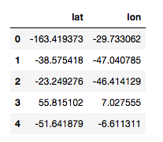
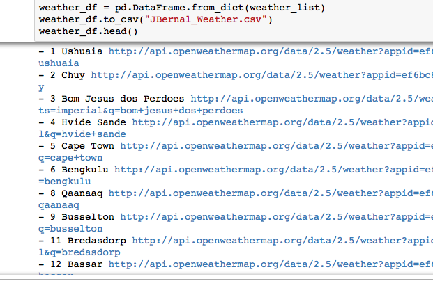
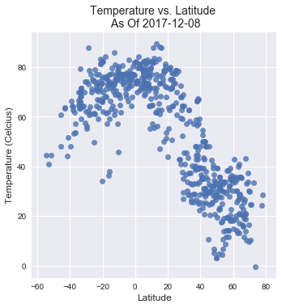
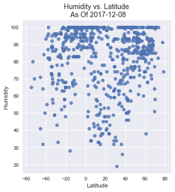
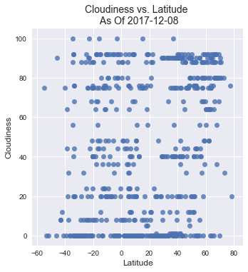
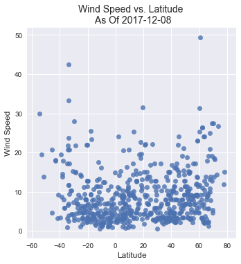

# WeatherPy

## What's the weather like as we approach the equator?

In this project, I built a python solution that visualized weather on over 500 cities accross the world of varying distance from the equator.  To accomplish this, I built python logic that generates latitudes and longitudes evenly spread out from each other.

With these generated coordinates, I used the OpenWeatherMap API to create a weather model that analyzed the relationship between these atmospherical factors, using scatterplots:

* Temperature (F) vs. Latitude

* Humidity (%) vs. Latitude

* Cloudiness (%) vs. Latitude

* Wind Speed (mph) vs. Latitude 

  -----------------------------------------------------

### Highlights:

 - As we approach the equator, the temperature doesn't simply get hotter, it may appear that way if we approach the equator from a latitude experiencing winter time.
 - Temperatures around the equator are pretty stable throughout the year, regardless of the elevation, because there aren't seasons in the equatorial latitudes.
 - High and Low altitudes exposed to full seasons, reverse their high and low temperatures around every 6 months.


```python
# Dependencies
from citipy import citipy
import json
from random import uniform
import pandas as pd
import requests as req
import matplotlib.pyplot as plt
import seaborn as sns
from datetime import datetime
# ! pip install citipy
```


```python
numberCoordinates = 3500

def latitude():
    return uniform(-180,180)#, uniform(-90, 90)
latitude = pd.DataFrame([(latitude() for x in range(numberCoordinates))])
lat = latitude.T

def longitude():
    return uniform(-90, 90)
longitude = pd.DataFrame([(longitude() for x in range(numberCoordinates))])
lon = longitude.T
lon

lat_lon = pd.concat([lat,lon], axis=1, join='inner')
lat_lon.columns = ["lat","lon"]

lat_lon.head()
```




```python
# Identify nearest city for each lat, lng combination
cities = []

for index, row in lat_lon.iterrows():
# for lat_lon in lalo:
    city = citipy.nearest_city(row[0], row[1]).city_name
    
   # If the city is unique, then add it to a our cities list
    if city not in cities:
        cities.append(city)

# Print the city count to confirm sufficient count
len(cities)
# cities
```


    692


```python
# Create a settings object with your API key and preferred units
api_key = "APIkeyGoesHere"
url = "http://api.openweathermap.org/data/2.5/weather?"
units = "imperial"
```


```python
weather_list = []
i = 0
for city in cities:
    try:
        i += 1
        # Dynamic query URL, query updates for each city
        query_url = url + "appid=" + api_key + "&units=" + units + "&q=" + city.replace(" ", "+")
        current_weather = req.get(query_url).json()
        # New weather dictionary
        weather_dict = {}
        # Extracting data-points from weather json file
        weather_dict['City'] = current_weather["name"]
        weather_dict["Lat"] = current_weather["coord"]["lat"]
        weather_dict["Lon"] = current_weather["coord"]["lon"]
        weather_dict["Temp"] = current_weather["main"]["temp"]
        weather_dict["Humidity"] = current_weather["main"]["humidity"]
        weather_dict["Cloudiness"] = current_weather["clouds"]["all"]
        weather_dict["Wind"] = current_weather["wind"]["speed"]
        # append data-points to weather dictionary
        weather_list.append(weather_dict)
        print("-", i, current_weather["name"], query_url, end = '\n')

    except:
        continue
#         print(city, end = ' ')

weather_df = pd.DataFrame.from_dict(weather_list)
weather_df.to_csv("JBernal_Weather.csv")
weather_df.head()
```

Sample print out of the python statement that returns all cities and their respective weather




```python
todaysDate = datetime.strftime(datetime.now(), "%Y-%m-%d")
# print(todaysDate)
```


```python
# Scatter Plot: Temperature vs. Latitude
# plt.scatter(weather_df["Lat"], weather_df["Temperature"], marker="o")
sns.lmplot(x="Lat", y="Temp", data=weather_df, fit_reg=False)

plt.title("Temperature vs. Latitude \n As Of " + todaysDate, fontsize=14)
plt.ylabel("Temperature (Celcius)", fontsize=12)
plt.xlabel("Latitude", fontsize=12)

plt.grid(True)

plt.savefig("TemperatureVsLatitude.png")

plt.show()
```



```python
# Scatter Plot: Humidity vs. Latitude

# plt.scatter(weather_df["Lat"], weather_df["Humidity"], marker="o")
sns.lmplot(x="Lat", y="Humidity", data=weather_df, fit_reg=False)

plt.title("Humidity vs. Latitude \n As Of " + todaysDate, fontsize=14)
plt.ylabel("Humidity", fontsize=12)
plt.xlabel("Latitude", fontsize=12)
plt.grid(True)

plt.savefig("HumidityVsLatitude.png")

plt.show()
```



```python
# Scatter Plot: Cloudiness vs. Latitude

# plt.scatter(weather_df["Lat"], weather_df["Cloudiness"], marker="o")
sns.lmplot(x="Lat", y="Cloudiness", data=weather_df, fit_reg=False)

plt.title("Cloudiness vs. Latitude \n As Of " + todaysDate, fontsize=14)
plt.ylabel("Cloudiness", fontsize=12)
plt.xlabel("Latitude", fontsize=12)
plt.grid(True)

plt.savefig("CloudinessVsLatitude.png")

plt.show()
```



```python
# Scatter Plot: Wind vs. Latitude
# plt.scatter(weather_df["Lat"], weather_df["Wind"], marker="o")
sns.lmplot(x="Lat", y="Wind", data=weather_df, fit_reg=False)

plt.title("Wind Speed vs. Latitude \n As Of " + todaysDate, fontsize=14)
plt.ylabel("Wind Speed", fontsize=12)
plt.xlabel("Latitude", fontsize=12)
plt.grid(True)

plt.savefig("WindSpeedVsLatitude.png")

plt.show()
```



This project can be found on my website:

http://www.juliobernal.com/Weather-Analysis